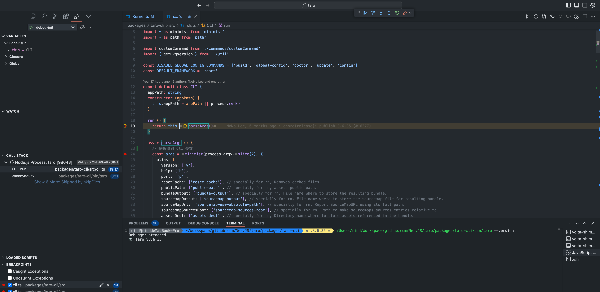
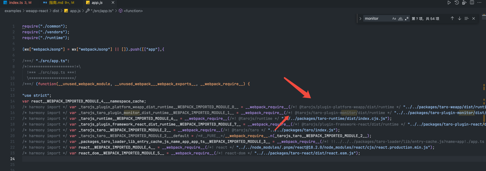

# taro 开发指南

tag 版本：`v3.6.35`，仓库地址：`https://github.com/NervJS/taro/tree/v3.6.35`

## 环境依赖

1. nodejs 20.x 版本
2. pnpm 8.x 版本
3. rust 很重要，关于 `rust` 的安装，可以参考 `https://www.rust-lang.org/tools/install`，进行安装， `taro-cli` 使用了 `rust` 开发 `crates/native_binding` 包提供的能力，如果没 `rust`，本地执行 `taro init xxx` 会报错。

**检查环境是否安装成功**

```bash
  node -v
  pnpm -v
  rustc --version
  cargo -v
```

## 准备工作

1. git clone taro 代码回本地，切换到 `v3.6.35` 版本

   ```bash
   git clone https://github.com/NervJS/taro.git
   ```

这里也可以 clone 我们的示例项目。

2. 安装依赖，需要安装 node 和 rust 项目的依赖，在 `taro` 根目录执行：

   ```bash
   # 只用使用 `pnpm` 8的版本来安装
   pnpm install

   # 安装 rust 依赖
   cargo build
   ```

3. 初始构建

   - 构建 `rust` 提供的包：`pnpm run build:binding:release`
   - 构建 `pnpm run build` 其他 node 包，确保项目可以正常编译和生成 `sourcemap`

4. 在需要更改、调试的包，执行 `pnpm run dev` 命令，启动调试，才能实时生效的，否则调试时候，断点可能不准确。

5. 在 vscode 调试终端执行想要的命令，打上断点。举例：

   ```bash
   绝对路径/packages/taro-cli/bin/taro --version
   ```

   

6. 创建项目示例，切换到需要创建 `project` 的目录，执行命令：

   ```bash
   cd examples
   绝对路径/packages/taro-cli/bin/taro init my-taro-app
   ```

   如果能看到 `✔ 安装项目依赖成功`，说明环境没任何问题，可以进行调试学习了。

## 如何开发

> 最佳实践的做法就是在 example 创建一个 workspace 项目，这样能使用 `"workspace:*"` 共享 `packages` 包内的代码。不推荐使用各种 link 到当前项目，因为有一些包对 link 支持不友好，后面不方便。

1. 启用开发模式，在 packages 找到开发的包都执行 npm run dev。
2. 切换到 example/weapp-react 目录，验证是否能断点调试

## Taro 仓库概览

1. taro-helper
2. taro-weapp： 小程序端平台插件
3. taro-runtime： dsl 运行时。
4. shared：所有平台共享变量、方法、常量等等
5. taro： taro.xxx 对象。
6. taro-plugin-react： react 端平台插件，这个就使用用来控制 支持 react 语法的
7. taro-react：基于 `react-reconciler` 的小程序专用 React 渲染器，连接 `@tarojs/runtime 的 DOM 实例，相当于小程序版的`react-dom`，暴露的 API 也和`react-dom` 保持一致。
8. taro-cli：运行接受参数，然后初始化或者动态调用 taro-service 注册的方法
9. taro-service： cli 内核、控制配置、插件、方法注册、编译、运行、打包、发布等功能
10. taro-webpack5-runner
11. taro-loader 动态合成小程序不同场景下的代码

## 如何编写 taro 插件

文档：<https://docs.taro.zone/docs/plugin-custom>

taro 插件开发 <https://docs.taro.zone/docs/plugin-custom>

## 基本概念

1. **什么是 taro 插件**

   taro 插件就是一个 export default 函数，包含插件本身 context 和 参数，插件开发，则是调用 ctx 暴露的方法，把相关逻辑，添加到 taro 编译和运行的生命周期中去。

   ```jsx
   export default (ctx, opts) => {}
   ```

2. **编译时插件**

   taro build、taro upload 可以给 taro cli 增加命令，<https://docs.taro.zone/docs/plugin-custom，官方示例>

   ```jsx
   export default (ctx) => {
     ctx.registerCommand({
       // 命令名
       name: 'upload',
       // 执行 taro upload --help 时输出的 options 信息
       optionsMap: {
         '--remote': '服务器地址',
       },
       // 执行 taro upload --help 时输出的使用例子的信息
       synopsisList: ['taro upload --remote xxx.xxx.xxx.xxx'],
       async fn() {
         const { remote } = ctx.runOpts
         await uploadDist()
       },
     })
   }
   ```

3. **运行时插件**

   可以给小程序运行增加一下方法，如 给 Taro 对象，增加一个属性、方法 功能等。<https://docs.taro.zone/docs/platform-plugin/reconciler>

   可以在 taro 编译和运行阶段，一起配合实现。

   最小示例，给 `taro View` 组件增加一个 `tid` 属性

   ```jsx
   import { isArray, isObject, isString } from '@tarojs/shared'
   import * as path from 'path'

   import { type IMonitorSetting, defaultMonitorSetting } from './config'

   import type { IPluginContext, TaroPlatformBase } from '@tarojs/service'

   export interface IOptions {}

   export default (ctx: IPluginContext, options: IOptions) => {
     const fs = ctx.helper.fs

     // 为什么是注册个 onSetupClose 方法？
     // taro 给 webpack/vite 编译工具包裹了一层，增加了一套自己生命周期方法。
     // onSetupClose 在每次编译前都会执行，所以我们能在此阶段通过，修改配置，从而达到扩展现有
     // 编译 or 运行时能力
     // 可参考：packages/taro-service/src/platform-plugin-base/mini.ts
     ctx.registerMethod({
       name: 'onSetupClose',
       fn(platform: TaroPlatformBase) {
         const template = platform.template
         if (!template) return

         // Notice：当前发现部分组件对新增 data-tid 属性不友好
         // 如果增加了自定义属性，可能导致页面渲染少一部分内容，或者属性错乱。
         // 'i.dataTid' 同名表示动态值，有值小程序才会渲染。
         template.mergeComponents(ctx, {
           View: {
             tid: 'i.tid',
           },
         })

         // 把监控配置转换成运行时配置。

         // 注入 runtime path
         // taro 支持多个 runtime：platform.runtimePath = [platform.runtimePath, injectedPath]
         // 通过这种方式，可以 动态扩展 hostConfig 和修改各种构建配置参数。
         // packages/taro-webpack5-runner/src/plugins/MiniPlugin.ts
         // runner 会把 runtimePath 传给 @taro/loader 进行处理
         // link: packages/taro-loader/src/app.ts
         injectRuntimePath(platform)
       },
     })
   }

   function injectRuntimePath(platform: TaroPlatformBase) {
     const injectedPath = `@tarojs/taro-plugin-monitor/dist/runtime`
     if (isArray(platform.runtimePath)) {
       platform.runtimePath.push(injectedPath)
     } else if (isString(platform.runtimePath)) {
       platform.runtimePath = [platform.runtimePath, injectedPath]
     }
   }
   ```

4. **端平台插件**

   简单说就是如微信平台、阿里平台、抖音平台，taro 就是通过加载不同的端平台插件，从而生成支持不同的平台的代码，需要开发写好对应专门模板，属性等等一大堆映射逻辑， \*\*\*\*<https://docs.taro.zone/docs/platform-plugin/how>

5. **如何使用插件**

在 taro 配置文件，plugin 、presets 添加，报名，绝对路径等。<https://docs.taro.zone/docs/plugin>

```jsx
const config = {
  plugins: [
    // 引入 npm 安装的插件
    '@tarojs/plugin-mock',
    // 引入 npm 安装的插件，并传入插件参数
    [
      '@tarojs/plugin-mock',
      {
        mocks: {
          '/api/user/1': {
            name: 'judy',
            desc: 'Mental guy',
          },
        },
      },
    ],
    // 从本地绝对路径引入插件，同样如果需要传入参数也是如上
    '/absulute/path/plugin/filename',
  ],
}
```

## taro 监控插件开发

1. 注册 onSetupClose 方法，此方法会在 taro runner 生命周期，setup 阶段（运行 webpack/vite 前），执行此方法。 `packages/taro-service/src/platform-plugin-base/mini.ts`

2. 修改端平台平台上下文，插入我们的运行时逻辑，`@tarojs/taro-plugin-monitor/dist/runtime`。platform.runtimePath 支持数组的。


最终 platform.runtimePath 代码会被 taro-loader 转换成到各地方。举例：

可以查看输出代码：examples/weapp-react/dist/app.js



3. hostConfig 包含了 在 taro 运行时各个阶段的 tapable hooks ，我们可以添加、修改增加我们的逻辑。

packages/taro-plugin-monitor/src/runtime.ts

详细 hooks 可以在
packages/shared/src/runtime-hooks.ts

  注意事项：

  1. TaroHook(HOOK_TYPE.SINGLE) 会被最后一个注册的事件覆盖
  2. TaroHook(HOOK_TYPE.MULTI) 则是允许并行注册
  3. 通过 hooks.tap('xxx'  注册事件
  4. 可以通过 hooks.call('hook名称' 搜索，了解 taro 在哪些地方触发注册是 钩子。

4. 在生命周期、点击事件、api 调用增加我们的日志上报 patch 代码。


最后交给 mergeReconciler： packages/shared/src/utils.ts 就是把循环 hostConfig 把里面的方法注册定义的 hooks 中。

```ts
export function mergeReconciler (hostConfig, hooksForTest?) {
  const obj = hooksForTest || hooks
  const keys = Object.keys(hostConfig)
  keys.forEach(key => {
    obj.tap(key, hostConfig[key])
  })
}

```

4. 打包时需要对编译时代码和运行时代码分别打包。


## 为什么采用阿里云 sls。

高性能，支持对数据二次解析，查询语法简单，价格低。

1. 日志上报与管理